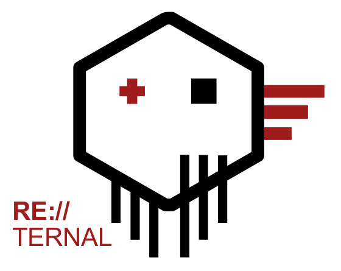

#  RE:TERNAL
-------------

---------------------

RE:TERNAL is a centralised purple team simulation platform. Reternal uses agents installed on a simulation network to execute various known
red-teaming techniques in order to test blue-teaming capabilities. The simulations are mapped to the MITRE ATT&CK framework. This repo contains
the VueJS project for the UI. Since the project is still in development, please do not run this in production or on an exposed interface yet.

#### Reternal components
- **API:** https://github.com/d3vzer0/reternal-backend.git
- **UI:** https://github.com/d3vzer0/reternal-ui.git
- **Agent:** https://github.com/d3vzer0/reternal-agent.git
- **Quickstart:** https://github.com/d3vzer0/reternal-quickstart.git

#### Component installation
Reternal components are primarily aimed to be run as docker containers since the component configuration depends on environment variables set by docker-compose or the dockerfile. A docker-compose with all the default options can be found on the reternal-quickstart repository. If you don't want to run the service within containers, adjust the config.py files with your own custom values.

#### Pre-Requirements
  - NodeJS
  - NGINX
  - VuejS
  - +- 15 Node/Vue components (found in package(lock).json)

#### Feature Requests & Bugs
We use the Github to manage Feature requests and Bug reports.

#### Developers and Contact

Joey Dreijer < joeydreijer@gmail.com >  
Yaleesa Borgman < yaleesa@gmail.com >

#### Whats up with the name?

This project has been re-developed so many times, it will probably never really finish. Hence RE (Redo) and Ternal (Eternal).

#### Special Thanks
  - MITRE ATT&CK - Framework used for mapping simulations: https://attack.mitre.org/wiki/Main_Page
  - Uber Metta -  Using Metta's templates for MITRE techniques with small (optional) adjustments to the purple_action format: https://github.com/uber-common/metta

