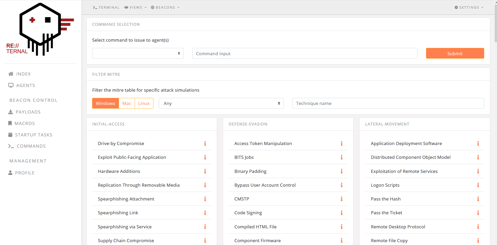

#  RE:TERNAL
-------------


---------------------

RE:TERNAL is a centralised purple team simulation platform. Reternal uses agents installed on a simulation network to execute various known
red-teaming techniques in order to test blue-teaming capabilities. The simulations are mapped to the MITRE ATT&CK framework. This repo contains
the VueJS project for the UI. For the back-end API, pull/cone the reternal-backend repository: https://github.com/d3vzer0/reternal-backend

#### Screenshot


## Project setup
```
npm install
```

### Compiles and hot-reloads for development
```
npm run serve
```

### Compiles and minifies for production
```
npm run build
```

### Run your tests
```
npm run test
```

### Lints and fixes files
```
npm run lint
```

### Customize configuration
See [Configuration Reference](https://cli.vuejs.org/config/).
